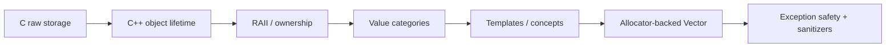

<div align="center">

# C++ Mastery

### Hands-on C and modern C++ systems labs focused on lifetime, ownership, generic programming, containers, and toolchain behavior.


[Case study](https://adrianrusu.dev/projects/cpp-mastery/) ·
[Vector lab](cpp/containers/vector/) ·
[C vector lab](c/vvector/) ·
[RAII lab](cpp/raii/)

</div>

---

**C++ Mastery** is a learning repository for making low-level C/C++ behavior observable instead of treating it as trivia. The labs move from raw storage and C-style generic containers through object lifetime, RAII, value categories, templates, concepts, ranges, allocators, and exception-safe container design.

> Build the abstraction. Trace the lifetime. Break the assumption. Verify the behavior.

The repository is intentionally educational; the custom containers are not replacements for the standard library.

## 🧭 Suggested learning path



| If you want to inspect… | Start here |
|---|---|
| 🧠 **Object lifetime** | [`cpp/lifetime/`](cpp/lifetime/) |
| 🧹 **RAII / ownership** | [RAII lab](cpp/raii/) |
| ↔️ **Move/forwarding behavior** | [`cpp/value_categories/`](cpp/value_categories/) |
| 🧩 **Templates and concepts** | [`cpp/templates/`](cpp/templates/) |
| 📦 **Allocator-aware container design** | [Vector lab](cpp/containers/vector/) |
| 🧪 **Test infrastructure** | [`cpp_mastery::test`](support/cpp/README.md) |
| 🧭 **Guided project narrative** | [C++ Mastery case study](https://adrianrusu.dev/projects/cpp-mastery/) |

---

## Highlights

| Area | What is exercised |
|---|---|
| Object lifetime | construction, destruction, copy/move behavior, raw storage vs live objects |
| Ownership / RAII | deterministic cleanup, Rule of Zero, moved-from states |
| Value categories | lvalues, rvalues, forwarding references, `std::move`, `std::forward` |
| Templates | deduction, class templates, concepts, variadic packs, fold expressions |
| Containers | C `vvector` and allocator-backed `Vector<T>` |
| Exception safety | partial-construction rollback and strong-guarantee experiments |
| Memory layout | contiguous storage, alignment, address/offset observations |
| Ranges | `Vector<T>` satisfies sized, common, random-access, contiguous range concepts |
| Tooling | custom `cpp_mastery::test` framework, CMake presets, CTest, strict warnings, ASan/UBSan, GitHub Actions CI |

## Repository map

```text
cpp-mastery/
├── .github/workflows/ci.yml
├── cmake/                         shared warning/sanitizer options
├── support/                       dependency-free test framework and C test support
├── c/
│   └── vvector/                   generic C dynamic vector + tests
├── cpp/
│   ├── containers/vector/         allocator-backed Vector<T>
│   ├── lifetime/                  object-lifetime tracing
│   ├── raii/                      Rule-of-Zero IntBuffer + tests
│   ├── value_categories/          lvalue/rvalue and forwarding experiments
│   ├── type_deduction/            auto / decltype behavior
│   └── templates/
│       ├── deduction/
│       ├── box/
│       ├── concepts/
│       └── folds/
├── archive/academic_exercises/    older coursework, excluded from default CI
├── CMakeLists.txt
└── CMakePresets.json
```

Each active lab has its own `README.md` and `CMakeLists.txt`, so the repository can be browsed as a set of focused case studies instead of one monolithic executable.

## Vector lab

The most substantial exercise is the custom allocator-backed `Vector<T>`:

```text
cpp/containers/vector/
├── include/cpp_mastery/vector/
│   ├── Vector.hpp                 public template interface
│   └── Vector.tpp                 template implementation
├── examples/vector_demo.cpp
└── tests/                         feature-focused test translation units
```

The implementation covers:

- `std::allocator<T>` / `std::allocator_traits`;
- explicit allocation and deallocation;
- `std::construct_at` / `std::destroy_at`;
- Rule of Five behavior;
- `reserve`, `push_back`, `emplace_back`, `pop_back`;
- both `resize` overloads;
- alias-sensitive growth such as `v.push_back(v[0])` and `v.resize(10, v[0])`;
- `std::move_if_noexcept` relocation;
- checked and unchecked element access;
- pointer iterators and standard ranges integration;
- exception rollback for failed copy/default/fill construction.

The `.tpp` is included by `Vector.hpp`; it is not a separately compiled source file. This keeps the public declaration readable while preserving the template-definition visibility required at instantiation sites.

See [the vector lab README](cpp/containers/vector/README.md) for the design and exception-safety notes.

## Tests

The C++ labs use a small dependency-free framework implemented in this repository: [`cpp_mastery::test`](support/cpp/README.md). It provides explicit `TestSuite` composition, `CHECK`/`REQUIRE` assertions, exception assertions, `std::source_location` diagnostics, CLI filtering, timing, and a console reporter.

The active test inventory is:

```text
vvector   10 C cases
raii       8 C++ cases
vector    43 C++ cases
----------------------
total     61 cases
```

CMake registers C++ suites separately with CTest, so CI failures identify the subsystem directly (`vector.copy`, `vector.resize`, `vector.resize-fill-exceptions`, and so on).

The C++ runners can also be used directly:

```bash
./containers_vector_tests --list
./containers_vector_tests --suite resize
./containers_vector_tests --test alias --verbose
```

Run the complete repository with:

```bash
cmake --preset dev
cmake --build --preset dev
ctest --preset dev
```

Or with sanitizers on GCC/Clang:

```bash
cmake --preset sanitize
cmake --build --preset sanitize
ctest --preset sanitize
```

## Build without presets

```bash
cmake -S . -B build -G Ninja -DCMAKE_BUILD_TYPE=Debug
cmake --build build
ctest --test-dir build --output-on-failure
```

Useful project options:

```text
CPP_MASTERY_WARNINGS_AS_ERRORS=ON
CPP_MASTERY_ENABLE_SANITIZERS=ON
CPP_MASTERY_BUILD_ARCHIVE=ON
```

The default active build uses C17 and C++26 with compiler extensions disabled.

## CI

`.github/workflows/ci.yml` builds and tests the active labs with:

- GCC on Linux;
- Clang on Linux;
- GCC with AddressSanitizer + UndefinedBehaviorSanitizer;
- MSVC on Windows.

CI turns the repository warning set into errors. GNU/Clang builds use:

```text
-Wall -Wextra -Wpedantic -Wconversion -Wshadow
```

MSVC uses `/W4 /permissive-`.

## Why this repository exists

My day-to-day work is Android/AAOS. This project deliberately moves closer to the mechanics beneath application-level code: ownership, storage, object lifetime, ABI-adjacent reasoning, generic programming, data layout, exception guarantees, and compiler/toolchain behavior.

It is a place to turn those concepts into executable experiments and progressively production-quality code organization.
